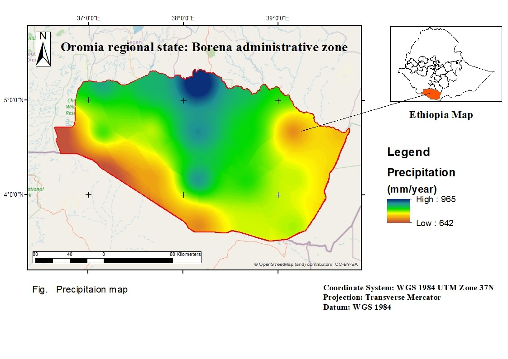
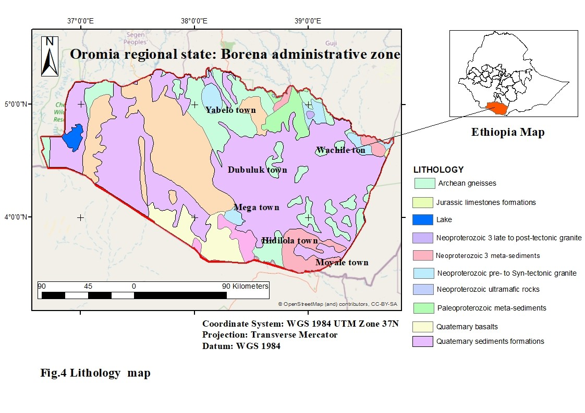
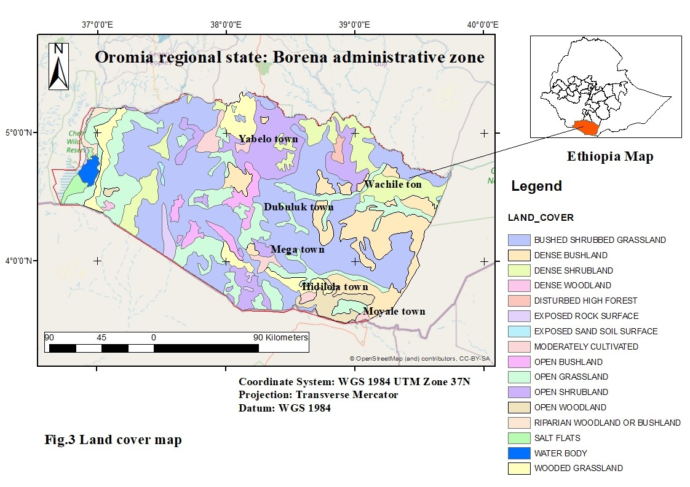
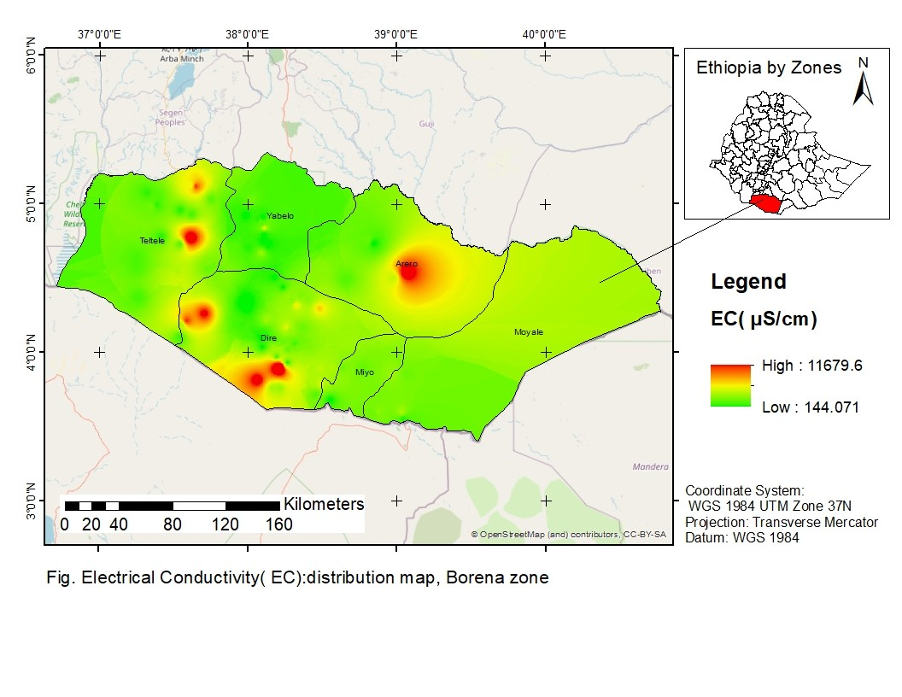
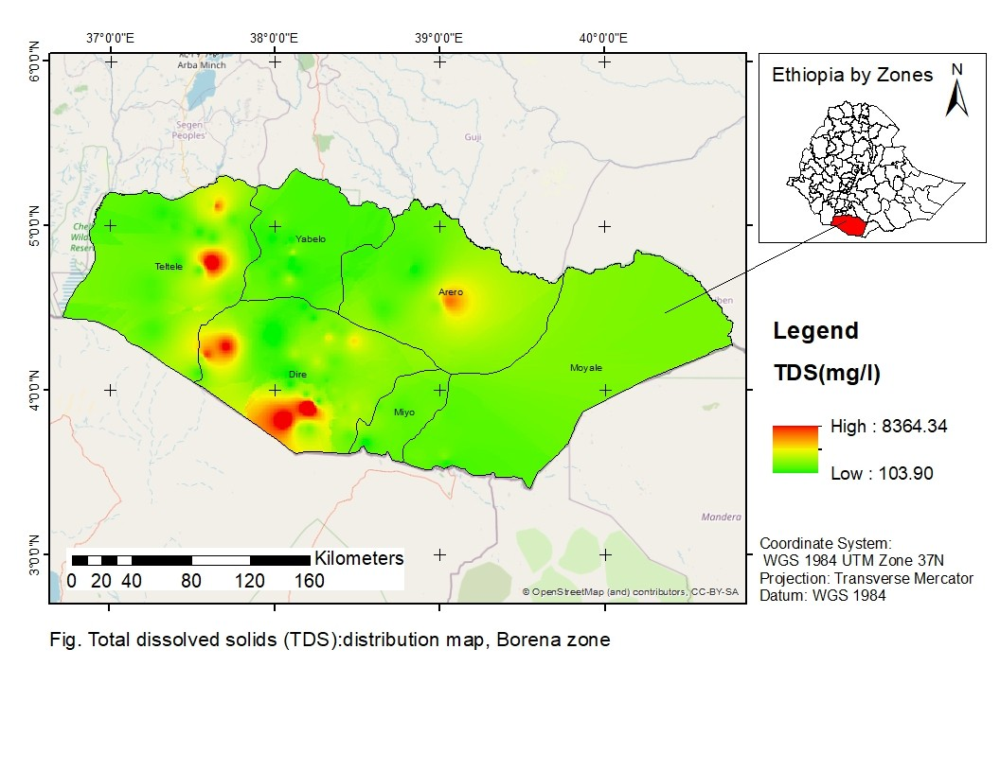

# Groundwater Quality Modeling - Borena Zone, Ethiopia

## Overview

This project presents a geostatistical analysis and groundwater quality assessment of Borena Zone, Ethiopia.

The study evaluates groundwater suitability for drinking purposes using hydrochemical parameters and spatial interpolation techniques.

## Objectives

- Assess groundwater quality
- Analyze TDS and EC relationships
- Produce groundwater quality maps
- Identify salinity hotspots
- Support groundwater management

## Study Area

Borena Zone, Oromia Region, Ethiopia

## Data Sources

- Groundwater laboratory data
- Landsat 8 imagery
- SRTM DEM
- Climate datasets
- Geological maps
- Soil maps

## Methods

- Data preprocessing
- Spatial analysis
- Geostatistics
- Ordinary Kriging
- Correlation analysis
- Land use classification

## Software

- ArcGIS
- ENVI
- QGIS
- SAGA GIS
- SPSS
- Python
  # Study Area

# Precipitation Map

# Geological Map

# Land Cover Map

# Electrical Conductivity Distribution

# Total Dissolved Solids Distribution

## Key Findings

- Groundwater quality assessed from 118 samples.
- Electrical Conductivity (EC) and Total Dissolved Solids (TDS) showed strong correlation.
- Correlation coefficient (R²) = 0.977.
- Relationship:

EC = 246.56 + 1.32(TDS)

- High salinity hotspots identified in:
  - Teltelle
  - Dire
  - Arero

- Low salinity groundwater observed in:
  - Yabello
  - Moyale
  - Miyo

## Technical Skills Demonstrated

- GIS Analysis
- Geostatistics
- Ordinary Kriging
- Spatial Analysis
- Remote Sensing
- Groundwater Modeling
- Water Quality Assessment
- SPSS
- ArcGIS
- Python
- Environmental Data Science

    
Author

Jifara Dabessa

MSc in Remote Sensing and Geoinformatics 

BSc in Computer Science

Advanced Diploma in Water Resources Engineering

Ministry of Water and Energy, Ethiopia

## Full Report

The complete research report is available:

[BorenaWQ_subsurfaceModelling.pdf](BorenaWQ_subsurfaceModelling.pdf)
